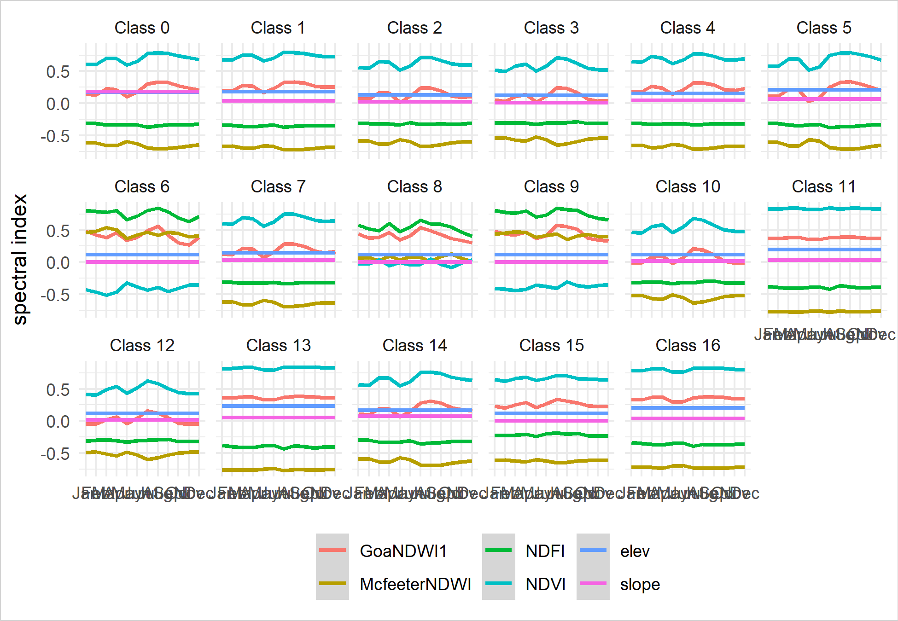

```{r, include=FALSE}
options(tinytex.engine = 'xelatex')
```

<!-- ```{r setup, include=FALSE} -->
<!-- knitr::opts_chunk$set(echo = TRUE,out.extra = '',fig.align='center',fig.pos='!htbp',cache=TRUE) -->
<!-- ``` -->

```{r setup, include=FALSE}
knitr::opts_chunk$set(echo = TRUE,out.extra = '',fig.align='center',fig.pos='!h',cache=TRUE)
```

```{r Setting-the-Scene,include=FALSE,echo=FALSE,cache=FALSE}
set.seed(123)
## loading required packages ####
if (!require("pacman")) install.packages("pacman")
pacman::p_load(
  rgee,
  tidyverse,
  sf,
  grid,
  gridExtra
)

ee_Initialize(email = 'issoufoul@gmail.com', drive = TRUE)
```

```{tikz conceptual-class,echo=FALSE,include=FALSE,fig.path='figures/',fig.ext='pdf',cache=FALSE,engine.opts=list(engine='xetex', template="latex/tikz2pdf.tex")}
% \tikz
\begin{tikzpicture}[mindmap]
\begin{scope}[
every node/.style={concept, scale=1, circular drop shadow,execute at begin node=\hskip0pt},
root concept/.append style={
scale = 1, concept color=black, fill=white, line width=1ex, text=black, font=\large\scshape},
text=white,
yes/.style={
concept color=green!50!black,faded/.style={concept color=green!50!black}
},
no/.style={concept color=red!50!black,faded/.style={concept color=red!50!black}
},
grow cyclic,
level 1/.append style={level distance=4.5cm,sibling angle=180,font=\scshape},
level 2/.append style={level distance=3cm,sibling angle=180,font=\scriptsize},
level 3/.append style={level distance=2cm,sibling angle=90,font=\scriptsize},
level 4/.append style={level distance=2cm,sibling angle=60,font=\scriptsize},
level 5/.append style={level distance=2cm,sibling angle=90,font=\scriptsize}
]

\node [root concept] {Irrigation uses water body} % root
child [no] { node {Runoff harvested and stored}
  child [yes]{ node {Crop flooded} 
    child [no]{ node {Crop relies physical irrigation}
      child [yes]{ node {Irrigated flood-based agriculture}}
      child [no]{ node {Post flood farming}}
    }
    child [yes]{ node {Micro flood-based irrigation}}
  }
  child [yes]{ node {Concrete structures}
    child [no]{ node { Unlined ponds and dams} }
    child [yes]{ node { of primary importance} 
      child [yes]{ node { lined ponds and dams} }
      child [no]{ node { Roof water harvesting} }
    }
  }
}
child [yes] { node {Permanent water body}
  child [yes]{ node {Permanent water diverted} 
    child [no]{node {Crop flooded} 
      child [yes]{node {Flood rise agriculture} }
      child [no]{node {Crop planted on river bed} 
        child [no]{node {Flood recession agriculture} }
        child [yes]{node {Inland farming} }
      }
    }
    child [yes]{node {Concrete structures}
      child [no]{node {Traditional inundation canals} }
      child [yes]{node {Replicate farmer options} 
        child [no]{node {Modern inundation canals} }
        child [yes]{node {Hybrid inundation canals} }
      }
    }
  }
  child [no]{ node {Ephemeral water diverted} 
    child [no]{ node {Crop flooded} 
      child [no]{ node {Crop planted on river bed} 
        child [no]{ node {Flow recession agriculture} }
        child [yes]{ node {River bed farming} }
      }
      child [yes]{ node {Lowland flooded crops} }
    }
    child [yes]{ node {Concrete structures} 
      child [yes]{ node {Replicate farmer options} 
        child [no]{node {Modern spate irrigation} }
        child [yes]{node {Hybrid spate irrigation} }
      }
      child [no]{ node {Traditional spate irrigation}} 
    }
  }
};
\end{scope}

\draw [ultra thick, lightgray](current bounding box.north west) rectangle (current bounding box.south east);

\end{tikzpicture}
```

```{r fig2,echo=FALSE,out.width='100%',fig.cap="A Conceptual classification of flood-based agriculture using simple decision tree rules based on water, vegetation and management aspects"}
knitr::include_graphics("figures/conceptual-class-1.pdf")
```
```{r common-specs,include=FALSE,echo=FALSE,cache=FALSE}
maxi = 17;

## Define a palette for the discrete output classification.####

palette = c(
  'aec3d4',  # water
  '152106',  '225129', '369b47', '30eb5b', '387242', # forest
  '6a2325',  'c3aa69', 'b76031', 'd9903d', '91af40',  # shrub, grass
  '111149', # wetlands
  'cdb33b', # croplands
  'cc0013', # urban
  '33280d', # crop mosaic
  'd7cdcc', # snow and ice
  'f7e084', # barren
  '6f6f6f',  # tundra
  # https://gis.stackexchange.com/questions/352462/scripting-color-palette-to-align-with-corresponding-classes-from-supervised-clas
  '0000FF', # water (0)  -- blue
  'FFFF00', # cultivated (1)  -- yellow
  'DCDCDC', #  Settlement (2) -- gray
  'F0E68C', # Grasslands (3)--khaki
  '228B22', # forest  (4)-- forest green
  '000000', #clouds (5)-- black
  '808000', #intact veg (6)-- olive
  'FFA500', #impacted_veg (7)-- orange
  'DC143C' #mines (8)-- crimson
);
discreteVizParam = list(min= 0, max= maxi, palette = palette);
# Define a palette for the continious output classification. 
# [0, 1] values assumed for probability
# var continiousVizParam = {min: 0, max: 1, palette: ['orange', 'yellow', 'white', 'lightgreen', 'darkgreen']};
continiousVizParam = list(min= 0, max= 1, palette = palette);

# The study area boundaries

# Horn of Africa
roiUp = ee$FeatureCollection('users/Liman/kenya_ethiopia_somalia_extent');

# Kisumu County, Kenya
# roi = ee$FeatureCollection('users/Liman/Kisumu_extent');
roiKis = ee$FeatureCollection('users/Liman/Kisumu_extended');


# Tigray, Ethiopia
# roi = ee$FeatureCollection('users/Liman/Tigray_extent');
# roi2 = ee$FeatureCollection('users/Liman/Tigray_extended');
roiTig = ee$FeatureCollection('users/Liman/Tigray_roi_extended');

Map$centerObject(roiKis);
# ee_print(roiKis$geometry()$bounds())
# var startDate = ee.Date('2015-01-01');  
startYear = 2015;  
# var endDate = ee.Date(Date.now()); 
endYear = 2020; 

months = ee$List$sequence(1, 12);
```

```{r functions,include=FALSE,echo=FALSE,cache=FALSE}
# Landsat 8 sanity 
#' Function to mask clouds based on the pixel_qa band of Landsat 8 SR data.
#' 
#' @param {ee.Image} image input Landsat 8 SR image
#' @return {ee.Image} cloudmasked Landsat 8 image
maskL8sr = function (image) {
  # # Bits 3 and 5 are cloud shadow and cloud, respectively.
  cloudShadowBitMask = bitwShiftL (1, 3);
  cloudsBitMask = bitwShiftL (1, 5);
  # # Get the pixel QA band.
  qa = image$select('pixel_qa');
  # Both flags should be set to zero, indicating clear conditions.
  mask = qa$bitwiseAnd(cloudShadowBitMask)$eq(0)$And(qa$bitwiseAnd(cloudsBitMask)$eq(0));
  out <- image$updateMask(mask);
};
# Landsat 7 sanity
#' Function to mask clouds based on the pixel_qa band of Landsat SR data.
#' 
#' @param {ee.Image} image Input Landsat SR image
#' @return {ee.Image} Cloudmasked Landsat image
cloudMaskL457 = function(image) {
  qa = image$select('pixel_qa');
  # If the cloud bit (5) is set and the cloud confidence (7) is high
  # or the cloud shadow bit is set (3), then it's a bad pixel.
  
  cloud = qa$bitwiseAnd(bitwShiftL(1, 5))$And(qa$bitwiseAnd(bitwShiftL(1, 7)))$Or(qa$bitwiseAnd(bitwShiftL(1,3)));
  # Remove edge pixels that don't occur in all bands
  mask2 = image$mask()$reduce(ee$Reducer$min());
  image$updateMask(cloud$Not())$updateMask(mask2);
};

#' Collect images from LANDSAT 4,5,7 and 8 based spatial and temporal filter 
#' 
#' @param  {String} collection Either 'LSR' (default) or 'TAO' indicating the collection of interest
#' @param  {FeatureCollection} roi The area of interset
#' @param  {Integer} startYear The beginning of the collection (e.g. 2000)
#' @param  {Integer} endYear The end of the collection
#' @param  {Integer} months Integer between 1 to 12 indicating the months of interest
#' @param  {Logical} includeL7 Whether to include LANDSAT 7 data in the collection. default to false
#' @return {ImageCollection}      A collection of image bands
collectLansatImages <- function (collection = 'LSR', roi, startYear, endYear, months = ee$List$sequence(1, 12), includeL7 = FALSE){
  startDate = ee$Date$fromYMD(startYear, 1, 1);
  endDate = ee$Date$fromYMD(endYear, 12, 31);
  
  if (collection == 'LSR'){
    # Assign a common name to the sensor-specific bands.
    l8_bands = list('B2',   'B3',    'B4',  'B5',  'B6',    'B7',    'B10'); #Landsat 8
    # l7_bands = list('B1',   'B2',    'B3',  'B4',  'B5',    'B7',    'B6_VCID_1'); #Landsat 7
    l7_bands = list('B1',   'B2',    'B3',  'B4',  'B5',    'B7',    'B6'); #Landsat 7
    l5_bands = list('B1',   'B2',    'B3',  'B4',  'B5',    'B7',    'B6'); #Landsat 4 and 5
    # modis_bands = ['sur_refl_b03', 'sur_refl_b04', 'sur_refl_b01', 'sur_refl_b02', 'sur_refl_b06', 'sur_refl_b07'];
    band_col = list('blue', 'green', 'red', 'nir', 'swir1', 'swir2', 'temp');
    
    
    img_col = ee$ImageCollection('LANDSAT/LC08/C01/T1_SR')$
      filterDate(startDate, endDate)$
      filterBounds(roi)$
      map(maskL8sr)$
      select(l8_bands, band_col)
    ;
    
    if(includeL7){
      img_col = ee$ImageCollection(img_col$merge(
        ee$ImageCollection('LANDSAT/LE07/C01/T1_SR')$
          filterDate(startDate, endDate)$
          filterBounds(roi)$
          map(cloudMaskL457)$
          select(l7_bands, band_col)
      ));
    }
    
    img_col = ee$ImageCollection(img_col$merge(
      ee$ImageCollection('LANDSAT/LT05/C01/T1_SR')$
        filterDate(startDate, endDate)$
        filterBounds(roi)$
        map(cloudMaskL457)$
        select(l5_bands, band_col)
    ));
    
    
    img_col = ee$ImageCollection(img_col$merge(
      ee$ImageCollection('LANDSAT/LT04/C01/T1_SR')$
        filterDate(startDate, endDate)$
        filterBounds(roi)$
        map(cloudMaskL457)$
        select(l5_bands, band_col)
    ));
    # img_col = ee$ImageCollection(img_col$merge(
    #   ee$ImageCollection('MODIS/MOD09A1')$
    #                   filterDate(startDate, endDate)$
    #                   filterBounds(roi)$
    #                   # map(maskL8sr)$
    #                   select(modis_bands, band_col)
    #             ));
    #   # return img_col;
  } else if (collection == 'TOA'){
    # Assign a common name to the sensor-specific bands.
    l8_bands = list('B2',   'B3',    'B4',  'B5',  'B6',    'B7',    'B10'); #Landsat 8
    l7_bands = list('B1',   'B2',    'B3',  'B4',  'B5',    'B7',    'B6_VCID_1'); #Landsat 7
    # l7_bands = list('B1',   'B2',    'B3',  'B4',  'B5',    'B7',    'B6'); #Landsat 7
    l5_bands = list('B1',   'B2',    'B3',  'B4',  'B5',    'B7',    'B6'); #Landsat 4 and 5
    # modis_bands = list('sur_refl_b03', 'sur_refl_b04', 'sur_refl_b01', 'sur_refl_b02', 'sur_refl_b06', 'sur_refl_b07');
    band_col = list('blue', 'green', 'red', 'nir', 'swir1', 'swir2', 'temp');
    
    img_col = ee$ImageCollection('LANDSAT/LC08/C01/T1_TOA')$
      filterDate(startDate, endDate)$
      filterBounds(roi)$
      # map(maskL8sr)$
      select(l8_bands, band_col)
    ;
    if(includeL7){
      img_col = ee$ImageCollection(img_col$merge(
        ee$ImageCollection('LANDSAT/LE07/C01/T1_TOA')$
          filterDate(startDate, endDate)$
          filterBounds(roi)$
          # map(maskL8sr)$
          select(l7_bands, band_col)
      ));
    }
    
    img_col = ee$ImageCollection(img_col$merge(
      ee$ImageCollection('LANDSAT/LT05/C01/T1_TOA')$
        filterDate(startDate, endDate)$
        filterBounds(roi)$
        # map(maskL8sr)$
        select(l5_bands, band_col)
    ));
    
    img_col = ee$ImageCollection(img_col$merge(
      ee$ImageCollection('LANDSAT/LT04/C01/T1_TOA')$
        filterDate(startDate, endDate)$
        filterBounds(roi)$
        # map(maskL8sr)$
        select(l5_bands, band_col)
    ));
    # return img_col;
  }
  
  # print(img_col);
  
  # Making monthly compute
  
  img_col = ee$ImageCollection(months$map(ee_utils_pyfunc(function(m) {
    out = img_col$filter(ee$Filter$calendarRange(
      start = m,
      field = 'month'
    ))$
      median()
    
    # return out;
  })));
  # return img_col;
}

#' Classify an image using unsupervised classification
#' @param  {Image} image The image to classify
#' @param  {Integer} nClass  The number of class to consider
#' @param  {Integer} scale   The resolution in meters to consider when sampling the training data
#' @param  {FeatureCollection} roi The region of interest
#' @return {ImageCollection}      A classifed images
unsuperClassifyThis <- function (image, nClass = 15, scale = 30, roi){
  # Make the training dataset.
  image = ee$Image(image);
  training = ee$Image(image)$sample(region=roi,scale=scale,numPixels=500);
  # Instantiate the clusterer and train it.
  clusterer = ee$Clusterer$wekaKMeans(nClass)$train(training);
  # Cluster the input using the trained clusterer.
  image$cluster(clusterer);
}

#' Classify an image using a proportion of training data
#' @param  {Image} image The image to classify
#' @param  {FeatureCollection} training The training data based on which to classify the image
#' @param  {String} propertyName The string name of the property in the training data
#' @param  {Number} split A number (default to 1) in the set (0, 1] specifying the proportion of training data to consider based on random sampling
#' @param  {String} outputMode Either 'CLASSIFICATION' (default) indication to return the classes or 'PROBABILITY' indicating to return class probabilities
#' @return {ImageCollection}      A classifed image
superClassifyThis <- function (image, training, propertyName = 'landcover', split=1, outputMode = 'CLASSIFICATION'){
  # Get a list of bands for supervized classification
  bands = image$bandNames();
  # Make the training dataset for supervized classification
  
  training = image$select(bands)$sampleRegions(collection=training,properties=list(propertyName),scale=30);
  training = training$randomColumn('random', 0);
  training = training$filter(ee$Filter$lt('random', split));
  # validation = sample$filter(ee$Filter$gte('random', split));
  if (training$geometry()$length() != 0){
    if (outputMode == 'CLASSIFICATION'){
      # Train CART classifier for classification
      classClassifiedCART = ee$Classifier$smileCart()$setOutputMode('CLASSIFICATION')$train(
        features=training,
        classProperty=propertyName,
        inputProperties=bands,
        subsampling=1,
        subsamplingSeed=0
      );
    } else if (outputMode == 'PROBABILITY'){
      # Train CART classifier for classification
      classClassifiedCART = ee$Classifier$smileCart()$setOutputMode('PROBABILITY')$train(
        features=training,
        classProperty=propertyName,
        inputProperties=bands,
        subsampling=1,
        subsamplingSeed=0
      );
    }
    
    # Run the classification
    classClassifiedCART = image$select(bands)$classify(classClassifiedCART);
    return (classClassifiedCART);
  } 
}

#' Subset a Feature Collection by attribute
#' @param  {FeatureCollection} feature The feature collection to filter
#' @param  {String} propertyName The string name of the property in the feature where to seek the filtering values
#' @param  {List} values An ee.List containing the values based on which to filter the feature
#' @return {featureCollection}      A feature collection reduced to [propertyNames] equal [values]
filterFeature <- function (feature, propertyName, values) {
  filter = ee$Filter$inList(propertyName, values);
  return (feature$filter(filter));
}

#' Drop a key from ee.Dictionary
#' @param  {Dictionary} dico A dictionary from which to drop the key
#' @param  {String} drop the key to drop from the dictionary 
#' @return {Dictionary}      A dictionary without the dropped keys
dropProperty <- function(dico, drop){
  dicoKeys = dico$keys();
  keep = dicoKeys$filter(ee$Filter$neq('item', drop));
  keep = dico$select(keep);
  return (keep);
}

#' Classify an image from different perspectives using different proportion of training data
#' @param  {Image} image The image to sample from
#' @param  {FeatureCollection} roi a region based on which to sample
#' @param  {Integer} scale The resolution to consider when sampling
#' @param  {Integer} nPoints The maximum number of points strata
#' @return {featureCollection}      A feature collection of non null sampled points
stratifiedSampling <- function (image, roi, scale=30, nPoints=50){
  geometry = roi$geometry();
  counts = image$reduceRegion(
    reducer=ee$Reducer$frequencyHistogram()$unweighted(), 
    geometry=geometry, 
    scale=scale,
    # bestEffort=true,
    maxPixels=1e13
  );
  counts = dropProperty(ee$Dictionary(ee$Dictionary(counts)$get('cluster')), 'null');
  stratified = ee$Dictionary(counts)$
    map(ee_utils_pyfunc(function(klass, count) {
      klass = ee$Number$parse(klass);
      masked = image$updateMask(image$eq(klass));
      return (masked$addBands(ee$Image$pixelLonLat())$
                sample(region=geometry, numPixels=nPoints*2, scale=scale, seed=klass)$
                randomColumn('x')$              # Random, but spatially ordered.  Reorder.
                sort('x')$
                limit(ee$Number(count)$min(nPoints))$
                map(function(f) {              # Extract a location for each point, for display
                  location = ee$Geometry$Point(list(f$get('longitude'), f$get('latitude')));
                  property = f$toDictionary();
                  return (ee$Feature(location, property));
                }));
    }))$values();
  return (ee$FeatureCollection(stratified)$flatten());
}

#' Recode a class in a ee.Feature
#' @param  {Feature} The feature from which the class is to be recoded
#' @param  {Integer} oldClass The value of the class to be recoded
#' @param  {Integer} newClass The value of the new class
#' @param  {String} propertyName The string name of the property in the feature
#' @return {Feature}      A feature with the class recoded
recodeClass <- function (feature, oldClass, newClass, propertyName) {
  out = ee$Algorithms$If(ee$Number(feature$get(propertyName))$eq(oldClass),
                         feature$set(propertyName, newClass), feature);
  return (ee$Feature(out));
}

#' Make binary class based on a target class in ee.featureCollection
#' @param  {FeatureCollection} FeatureCollection The featureCollection containing the classes as properties
#' @param  {Integer} mainClass The (target) class to distinguished from other classes
#' @param  {String} propertyName The string name of the property holding the classes in the FeatureCollection
#' @return {Feature}      A FeatureCollection with two classes, typically recoded with the target class as 1 and all other classes as 0
makeBinaryClass <- function (featureCollection, mainClass, propertyName, relative = TRUE){
  # mainClass = ee$Number (mainClass);
  featureCollection = featureCollection$map(ee_utils_pyfunc(function(x){
    return (ee$Algorithms$If (
      condition=ee$Number(x$get(propertyName))$eq(mainClass),
      trueCase=recodeClass(x, mainClass, ee$Number(x$get(propertyName))$add(1), propertyName),
      falseCase=recodeClass(x, ee$Number(x$get(propertyName)), ee$Number(0), propertyName)
    ));
  }));
  # if(relative==true){
  # inMainClass = filterFeature(featureCollection, propertyName, list(ee$Number(1)));
  inMainClass = featureCollection$filter(ee$Filter$neq(propertyName, 0));
  outMainClass = filterFeature(featureCollection, propertyName, list(ee$Number(0)));
  totalSize = featureCollection$size();
  size = inMainClass$size();
  split = size$divide(totalSize);  # Roughly the size of the main class.
  outMainClass = outMainClass$randomColumn('random');
  outMainClass = outMainClass$filter(ee$Filter$lte('random', split));
  # validation = sample$filter(ee$Filter$gte('random', split));
  reducedFeatureCollection = inMainClass$merge(outMainClass);
  # } else {
  #   featureCollection = featureCollection
  # }
  featureCollection = ee$Algorithms$If (
    condition=relative, # ee$Algorithms$IsEqual(true, relative),
    trueCase=reducedFeatureCollection,
    falseCase=featureCollection
  );
  return (ee$FeatureCollection(featureCollection));
}

#' Generate class probabilities based on training data
#' @param  {Image} image The image to classify
#' @param  {FeatureCollection} training The taining data
#' @param  {String} propertyName The name of the property holding the class values in the training data
#' @return {Feature}      A FeatureCollection 
mapClassProbabilities <- function  (image, training, propertyName){
  training = ee$FeatureCollection(training)
  nClass = training$aggregate_array(propertyName)$distinct()$sort();
  classIndex = nClass$map(ee_utils_pyfunc(function(x){
    index = nClass$indexOf(x);
    x = makeBinaryClass(training, x, propertyName, FALSE);
    classValue = x$aggregate_array(propertyName)$distinct()$sort();
    x = x$remap(classValue, list(0,1), propertyName);
    x = superClassifyThis(image, x, propertyName, 1, 'PROBABILITY')$ #.rename('prob')
      addBands(ee$Image$constant(index)$int()); # .rename('index');
    return (x);
  }));
  classIndex = ee$ImageCollection(classIndex)$reduce(ee$Reducer$max(2))$rename('prob', 'index');
  # $select('index');
  return (classIndex);
}

#' Compute a Receiver Operator Curve
#' 
#' @param  {Image} image The image containing class probabilities
#' @param  {FeatureCollection} targetFeature A feature collection containing a sample of true positive for the class of interest
#' @param  {FeatureCollection} nonTargetFeature A feature collection containing a sample of true negative for the class of interest
#' @param  {Integer} scale The resolution to consider when sampling
#' @param  {Integer} ROC_steps The number of steps for receiver operator curve
#' @return {Feature}      A FeatureCollection 
rocThis = function(image, targetFeature, nonTargetFeature, scale=30, ROC_steps=1000) {
    # if (scale === undefined || scale === null){
      #   scale = 30;
      # }
    targetFeature = image$reduceRegions(
      collection=targetFeature,
      reducer=ee.Reducer$max()$setOutputs(list('proba')),
      scale=scale
    )$
    map(function(x){
      return (x$set('is_target',1));
    });
    
    nonTargetFeature = image$reduceRegions(
      collection=nonTargetFeature,
      reducer=ee$Reducer$max()$setOutputs(list('proba')),
      scale=scale
    )$
    map(function(x){
      return (x$set('is_target',0));
    });
    
    features = targetFeature$merge(nonTargetFeature);
    
    # Chance these as needed
    ROC_field = 'proba'; ROC_min = 0; ROC_max = 1; ROC_points = features;
    
    ROC = ee$FeatureCollection(
      ee$List$sequence(
        start=ROC_min, 
        end=ROC_max,
        step=null,
        count=ROC_steps
      )$
      map(ee_utils_pyfunc(function (cutoff) {
        target_roc = ROC_points$filterMetadata(
          name='is_target',
          operator='equals',
          value=1
        );
        
        # true-positive-rate, sensitivity  
        TPR = ee$Number(
          target_roc$filterMetadata(
            name=ROC_field,
            operator='greater_than',
            value=cutoff
          )$
          size()
        )$
        divide(target_roc$size());
        
        
        non_target_roc = ROC_points$filterMetadata(
          name='is_target',
          operator='equals',
          value=0
        );
        
        
        # true-negative-rate, specificity  
        TNR = ee$Number(
          non_target_roc$filterMetadata(
            name=ROC_field,
            operator='less_than',
            value=cutoff
          )$
          size()
        )$
        divide(non_target_roc$size());
        
        
        # Create a null geometry feature with the dictionary of properties.
        out = ee$Feature(
          null,
          c(
            cutoff=cutoff, 
            TPR=TPR, 
            TNR=TNR, 
            FPR=TNR$subtract(1)$multiply(-1),
            dist=TPR$subtract(1)$pow(2)$add(TNR$subtract(1)$pow(2))$sqrt()
          )
        );
        return (out);
      }))
    );
    # Use trapezoidal approximation for area under curve (AUC)
    X = ee$Array(ROC$aggregate_array('FPR')); 
    Y = ee$Array(ROC$aggregate_array('TPR')); 
    Xk_m_Xkm1 = X$slice(0,1)$subtract(X$slice(0,0,-1));
    Yk_p_Ykm1 = Y$slice(0,1)$add(Y$slice(0,0,-1));
    AUC = Xk_m_Xkm1$multiply(Yk_p_Ykm1)$multiply(0.5)$reduce('sum',list(0))$abs()$toList()$get(0);
    
    ROC = ROC$map(function(x){
      return (x$set('AUC', AUC));
    });
    # find the cutoff value whose ROC point is closest to (0,1) (= "perfect classification")      
    ROC_best = ROC$sort('dist')$first()$get('cutoff');
    
    ROC = ROC$map(function(x){
      return (x$set('ROC_best', ROC_best));
    });
    
    return (ROC); 
  };
```

```{r kisumu,include=FALSE,echo=FALSE,cache=FALSE}

imageCollection = collectLansatImages ('LSR', roiUp, startYear, endYear, months);
# ee_print(imageCollection)

imageCollection = imageCollection$
  reduce(ee$Reducer$sum())$
  rename(imageCollection$first()$bandNames())$
  addBands(ee$Image('CGIAR/SRTM90_V4')$select('elevation')$rename('elev'))$
  addBands(ee$Terrain$slope(ee$Image('CGIAR/SRTM90_V4')$select('elevation')$rename('elev'))$rename('slope'));

# ee_print(imageCollection)

# Generating an unsupervized classification (for each month) based on which to collect class samples for superivised classification
stratified = unsuperClassifyThis(imageCollection, maxi, 30, roiKis);
# ee_print(stratified)

Map$addLayer(
  eeObject = stratified,
  visParams = discreteVizParam,
  name = "unsuperClassificationKisumu"
)


# # Exporting the unsupervised classification
# Export$image$toDrive(
#   image=stratified,
#   description='Kisumu_unsuper_class_mode_16classes_30m_500pts_LSR_L8_L5_L4_2015_2020',
#   folder='Kisumu',
#   scale=30,
#   region=roiUp,
#   fileFormat='GeoTIFF',
#   maxPixels=1e13
# );
ndsi = collectLansatImages ('LSR', roiKis, startYear, endYear, months);

ndsi = ndsi$map(ee_utils_pyfunc(function(x){
  return (stratified$rename('class')$
  addBands(x$normalizedDifference(list('nir', 'red'))$rename('NDVI'))$
  addBands(x$normalizedDifference(list('nir', 'swir1'))$rename('GoaNDWI1'))$
  # addBands(x$normalizedDifference(list('nir', 'swir2'))$rename('GoaNDWI2'))$
  addBands(x$normalizedDifference(list('green', 'nir'))$rename('McfeeterNDWI'))$
  addBands(x$normalizedDifference(list('red', 'swir2'))$rename('NDFI'))$
  addBands(ee$Image('CGIAR/SRTM90_V4')$select('elevation')$rename('elev'))$
  addBands(ee$Terrain$slope(ee$Image('CGIAR/SRTM90_V4')$select('elevation')$rename('slope')))$
  stratifiedSample(
    numPoints=1000, 
     # classBand: 'class', 
    region=roiKis, 
    scale=500, 
    projection=NULL, 
    seed=0, 
    classValues=NULL, 
    classPoints=NULL, 
    dropNulls=TRUE, 
    tileScale=1, 
    geometries=FALSE
  ))
}))$flatten()

ndsi <- ee_as_sf(ndsi, via = 'getInfo', maxFeatures= 216000)

process_ndsi <- function(ndsi){
  ndsi <- st_drop_geometry(ndsi)
  ndsi$slope = ndsi$slope/100 # to make slope to the scale of ndsi
  ndsi$elev = ndsi$elev/10000 # to make elevation to the scale of ndsi
  id_cols <- stringr::str_split_fixed(ndsi$id, "_", 2)
  colnames(id_cols) <- c('Month', 'Point_id')
  ndsi <- data.frame(id_cols[, c(2,1)], ndsi[, -1])
  ndsi$Month <- as.integer(ndsi$Month)
  # head(ndsi)
  ndsi <- ndsi[order(ndsi$Month, decreasing = FALSE),]  
  ndsi <- transform(ndsi, MonthAbb = month.abb[Month])
  ndsi$MonthAbb <- factor(ndsi$MonthAbb, levels = unique(ndsi$MonthAbb))
  
  ndsi$class <- paste("Class", ndsi$class)
  ndsi$class <- factor(ndsi$class, unique(ndsi$class))
  ndsi  <- reshape2::melt(ndsi, id.vars = c("Point_id", "Month", "MonthAbb", "class"))
}
```


```{r kisumu-unsuper-ndsi,include=FALSE,echo=FALSE,cache=FALSE}
p <- ndsi %>%
  process_ndsi()%>%
  ggplot(aes(MonthAbb, value, fill=Point_id, group=variable))+
  geom_smooth(aes(color = variable), method = 'loess', se=TRUE, span = 0.4)+
  facet_wrap(.~class, ncol = 6)+
  theme_minimal()+
  theme(
    legend.position = 'bottom',
    axis.title.x = element_blank(),
    legend.title = element_blank()
  )+
  labs(y="spectral index")

gb = grid.rect(.5,.5,width=unit(1,"npc"), height=unit(1,"npc"), 
               gp=gpar(lwd=1, fill=NA, col="lightgray"))

p <- grid.arrange(p, ncol=1)
p <- gTree(children = gList(p, gb))
ggsave(plot=p, device = 'png', filename = "figures/Kisumu_unsuper_NDSI.png", 
       # width = 190/25.4, height = 140/25.4, 
       dpi = 300)
ggsave(plot=p, device = 'tiff', filename = "figures/Kisumu_unsuper_NDSI.tif",
       # width = 190/25.4, height = 140/25.4, 
       dpi = 300)
ggsave(plot=p, device = 'pdf', filename = "figures/Kisumu_unsuper_NDSI.pdf", 
       # width = 190/25.4, height = 140/25.4, 
       dpi = 300)

```

```{r fig4,echo=FALSE,out.width='100%',fig.cap="Temporal variability in water and vegetation for different land uses based on an unsupervised classification of 17 classes in Kisumu county, Kenya."}

```

# Introduction {#I}

Drylands Agriculture and its transformations have important implications for global food security, particularly under the current population and climate trends (Dixon, Gulliver, & Gibbon, 2001; FAO, 2017; van Steenbergen, Lawrence, Mehari, Salman, & Faurès, 2010). Experience has shown that an improvement in farm income results in 2 to 4 times additional non-farm income (Garrity, Dixon, & Boffa, 2012). Consequently, problems with regards to farm level productivity may produce the opposite effect and may affect food systems on much larger scale. In Eretria, for instance, a country where agriculture play a vital role, the total population would double between 2005 and 2015 causing a food gap of 850, 000 tons (Haile, 2010).  Under such impeding constraints, drylands Agriculture is experiencing important transformations to accommodate to these global changes using innovative practices at various scales (FAO, 2017). In flood-based Agriculture, these are shaped by complex social and institutional processes - mainly in forms of soil and water conservation - to produce food under uncertainty (Haile, 2010; Harlan & Pasquereau, 1969; Puertas, Steenbergen, Haile, Kool, & Embaye, 2011; van Steenbergen et al., 2010). Despite their extensive and risky nature, flood-based farming systems (FBFS) make substantial contribution to food systems in many drylands areas where they support the livelihoods of millions. For example, it has been estimated that the development of  391,000 ha through spate irrigation would resolve the Eritrean food gap (Haile, 2010). FBFS satisfy the 5 requirements of the 20 major world farming systems for households strategies to escape from poverty and hunger described in Dixon et al. (2001). These include the agricultural intensification which is achieved through improved production by the means of better water and nutrient supply; the diversification of activities  which is conveyed by the ranges of crops grown, the integration of livestock and other off-farms income generating activities; the  farm  size expansion which is apparent via the encroachment of  non-farmed floodplains;  the possibility for  non-farm  income through the investment of farm income into non-farm commercial activities;  and the exit  or  departure  from agriculture via migration when the payoff is relatively low. 

The promises above-mentioned can be expected considering the value of additional irrigation in rainfed agriculture (Haile, 2010; van Steenbergen et al., 2010) and the willingness of many countries to endorse rural development reforms with specific expectations (FBLN, 2018). Some of these expectations are as ambitious as doubling the country wide production through larger scales flood-based water diversion (Droy & Morand, 2015; Haile, 2010; van Steenbergen et al., 2010). Meeting such objectives may requires the recognition of the typology of site-specific innovations along with the attuned social processes required for sustainable production. Surprisingly, this recognition is still at the early days because FBFS are missing from the famous farming systems handbooks (Dixon et al., 2001; Garrity et al., 2012; McConnell & Dillon, 1997). Puertas et al. (2011) introduce a classification for flood-based farming systems based on the nature and use of the flood inundation. In their guidelines on spate irrigation, van Steenbergen et al. (2010) provide a classification of spate irrigation, a variant of flood-based agriculture, using on the size of the scheme and management arrangements as the main criteria. In our opinion, however, these classifications lack enough details for operationalizing the basic concepts into a framework for action.

The lack of framing FBFS as standalone topic may have led to the lack of  attention of agricultural research and policy to FBFS (Erkossa, Langan, & Hagos, 2014) and reflected in the common practice to classify agro-ecosystems as either rain-fed or irrigated (Dixon et al., 2001; Garrity et al., 2012; van Steenbergen et al., 2010). However, the peculiar settings under which FBFS are practiced makes them nor rainfed nor irrigated inasmuch as they are rainfed agricultural systems often receiving appreciable amount of irrigation (Haile, 2010; van Steenbergen et al., 2010). Recognising the typology of FBFS would leverage agricultural intensification particularly when site-specific differences are accounted for. Furthermore, even though farmers have unique realities, many share common problems that may transcend any boundary set by mankind (Dixon et al., 2001). In this regards, a classification framework should be anchored at farm level to ultimately categorize similar farmlands into baskets to which similar research and actions would be applied (Dixon et al., 2001; Garrity et al., 2012). Indeed, this would clarify similar investment opportunities, benefit their risk assessment, and cleanly address site-specific problems for optimized agricultural production (Garrity et al., 2012). Prescribing such risk assessment, preferably in quantitative forms, is currently needed because, in most FBFS, decision makers face the challenge of identifying which course of action would result in the greatest agricultural productivity. In many cases, new potentially promising area over which to explore new investment opportunities comport high production risk and uncertainty causing donors and farmers to often remain cautious to invest (Garrity et al., 2012). These promising areas are not often well known or requires the identification of break-through improvements (Droy & Morand, 2015; Luedeling et al., 2015; van Steenbergen et al., 2010; Whitney, Lanzanova, et al., 2018; Whitney, Shepherd, & Luedeling, 2018) supporting the need to formally recognize the topic of  flood-based agriculture and its variants as standalone thematic area. 

Typically farming systems are classified in terms similar natural endowments, entrepreneurship, constraints and opportunities, and development opportunities  (Dixon et al., 2001). Identifying the existing FBFS categories may require, in the first place, the identification of key factors determining type-specific hydrology which are shaped by the social mechanisms in place. The objective of this paper is to develop a conceptual framework for system analysis for flood-based agriculture. we start by defining the concepts, reports their importance using publicly available data and other sources, and discusses their typology. We further argue on their potentials and their risky and uncertain nature and propose the use of decision analysis principals to support development interventions.

# reference {#VI}
